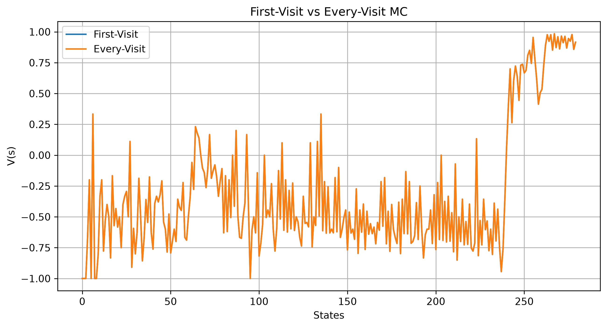
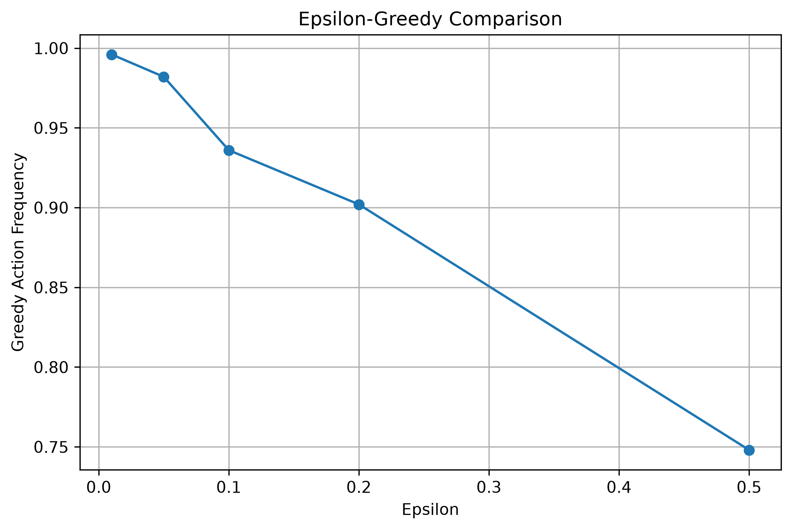
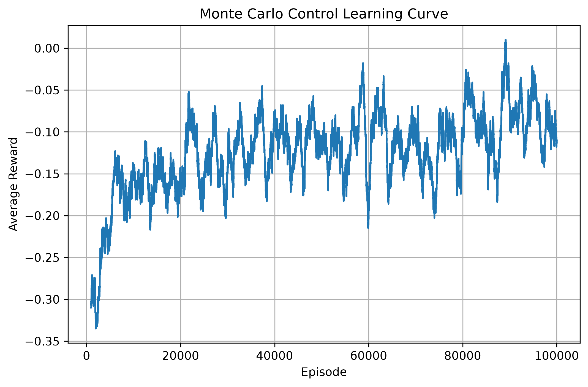

# Lab03 - Monte Carlo Methods

## Thông tin sinh viên

- Họ tên: Vũ Chí Sơn
- MSSV: 24105091

## Môi trường đã chọn

- Môi trường chính: `Blackjack-v1`
- Môi trường phụ: Không có
- Lý do lựa chọn:
  - `Blackjack-v1` là bài toán episodic, mỗi ván kết thúc rõ ràng nên tính được return đầy đủ.
  - State rời rạc `(player_sum, dealer_card, usable_ace)` nên lưu V(s), Q(s,a) dạng bảng được.
  - Phù hợp trực tiếp với Monte Carlo prediction và control.

## Mục tiêu

Lab03 học giá trị và policy **từ các episode quan sát được**, không dùng transition model hay reward model (model-free). Nội dung gồm:

1. Sinh episode từ một policy và lưu trajectory.
2. Tính return `G_t` (có discount factor `gamma`).
3. Cài đặt First-Visit và Every-Visit MC prediction để ước lượng V(s).
4. Ước lượng Q(s,a).
5. Xây dựng epsilon-greedy policy.
6. Cài đặt On-policy MC control.
7. Đánh giá policy học được, so sánh với random policy và fixed policy.
8. Quan sát sự hội tụ khi tăng số episode.

## Cài đặt

```bash
pip install -r requirements.txt
```

Nội dung `requirements.txt`:

```text
gymnasium[toy-text,classic-control]
numpy
matplotlib
jupyter
```

## Cách chạy

Chạy chương trình chính:

```bash
cd Lab03
python src/main.py
```

Chạy notebook:

```bash
jupyter notebook notebooks/Lab03_24105091_VuChiSon.ipynb
```

Hoặc mở notebook trên Google Colab rồi chọn **Runtime → Run all**.

## Cấu trúc thư mục

```text
Lab03/
├── README.md
├── requirements.txt
├── src/
│   ├── bai01.py ... bai36.py
│   ├── mc_utils.py
│   └── main.py
├── notebooks/
│   └── Lab03_24105091_VuChiSon.ipynb
├── figures/
│   ├── mc_convergence.png
│   ├── first_vs_every_visit.png
│   ├── epsilon_comparison.png
│   └── policy_performance.png
├── videos/
└── data/
    └── README.md
```

> Sửa lại cho khớp với cấu trúc thật trong thư mục `Lab03` của bạn.

## Episode và Return

Một episode có dạng `S0, A0, R1, S1, A1, R2, ..., ST`, được lưu bằng danh sách `(state, action, reward)`.

Return tại timestep `t`:

```text
G_t = R_(t+1) + gamma * R_(t+2) + gamma^2 * R_(t+3) + ...
```

Return được tính **ngược từ cuối episode**: `G_t = R_(t+1) + gamma * G_(t+1)`.

Hàm liên quan trong `mc_utils.py`: `generate_episode()`, `compute_returns()`.

Nhận xét về `gamma` (Bài 10): ...........

## First-Visit MC

- Chỉ dùng return tại **lần xuất hiện đầu tiên** của state trong mỗi episode.
- V(s) là trung bình các return đó.
- Hàm: `first_visit_mc_prediction(env, policy, n_episodes, gamma)`.
- Policy dùng để đánh giá: `stick_on_20_policy` (dừng khi tổng điểm >= 20).
- Số state ước lượng được theo số episode:

| Số episode | Số state được ước lượng |
|---:|---:|
| 100 | ... |
| 1000 | ... |
| 10000 | ... |
| 50000 | ... |

## Every-Visit MC

- Dùng return ở **mọi lần** state xuất hiện trong episode.
- Hàm: `every_visit_mc_prediction(env, policy, n_episodes, gamma)`.
- So sánh với First-Visit (cùng policy, gamma, n_episodes, seed):
  - Mean absolute difference trên các state chung: ...........
  - Nhận xét: ...........



## Action-value Q(s,a)

- Lưu `(state, action) -> return` và lấy trung bình để được `Q[state][action]`.
- Hàm: `mc_action_value_prediction()`, `greedy_action()` (dùng `np.argmax`).
- Vì sao control cần Q(s,a) thay vì chỉ V(s): khi không có model, chỉ có V(s) thì không biết action nào dẫn tới state tốt hơn, còn Q(s,a) cho biết trực tiếp giá trị của từng action.

## Epsilon-greedy

- Xác suất `1 - epsilon`: chọn action greedy. Xác suất `epsilon`: chọn ngẫu nhiên để khám phá.
- Hàm: `epsilon_greedy_action(Q, state, n_actions, epsilon, rng)`.
- Kiểm tra với `Q = [1.0, 5.0]`, `epsilon = 0.1`, 10000 lần chọn: tần suất action 0 = ..., action 1 = ...
- So sánh `epsilon = 0.01, 0.05, 0.10, 0.20, 0.50`: ...........



## On-policy MC Control

Quy trình:

```text
Khởi tạo Q
   ↓
Sinh episode bằng epsilon-greedy
   ↓
Tính return
   ↓
First-visit update Q(s,a) bằng incremental mean
   ↓
Cập nhật policy epsilon-greedy
   ↓
Lặp lại
```

Cập nhật incremental mean:

```text
N(s,a) = N(s,a) + 1
Q(s,a) = Q(s,a) + (G - Q(s,a)) / N(s,a)
```

- Hàm: `on_policy_mc_control(env, n_episodes, gamma, epsilon, seed)`, trả về `Q`, `policy`, `episode_rewards`.
- Cấu hình huấn luyện: `n_episodes = ......` (>= 100000), `gamma = ...`, `epsilon = ...`, `seed = 42`.

Policy học được tại một số state (không hard-code):

| State `(player_sum, dealer, usable_ace)` | Action học được |
|---|---|
| (20, 10, False) | ... |
| (18, 6, False) | ... |
| (13, 2, False) | ... |
| (18, 6, True) | ... |

(Action: `0 = Stick`, `1 = Hit`.)

## Kết quả

Đánh giá trên 10000 episode mới (`seed = 123`):

| Policy | Win rate | Loss rate | Draw rate | Mean reward |
|---|---:|---:|---:|---:|
| Random | ... | ... | ... | ... |
| Fixed (`stick_on_20`) | ... | ... | ... | ... |
| MC learned | ... | ... | ... | ... |


## Learning Curve

Moving average của `episode_rewards` với `window = 1000`.



Nhận xét: ...........

## So sánh policy

- Random policy: ...........
- Fixed policy: ...........
- MC learned policy: ...........
- Policy học được chưa chắc tối ưu tuyệt đối vì còn phụ thuộc số episode, epsilon và tính ngẫu nhiên của Blackjack.

## Nhận xét

- Khi số episode tăng, estimate V(s) ổn định dần (gần với giá trị thật hơn).
- Monte Carlo là model-free, không bootstrap, và phải chờ hết episode mới cập nhật.
- epsilon quá lớn thì agent hành động ngẫu nhiên quá nhiều, policy học chậm; epsilon quá nhỏ thì thiếu khám phá, dễ kẹt ở policy kém.
- Điểm khác Dynamic Programming: MC học từ trải nghiệm thực tế, không cần biết transition/reward model.
- Hạn chế và hướng cải thiện: ...........
- (Tùy chọn) Phần mở rộng đã làm: Off-policy MC / Weighted Importance Sampling / môi trường khác.

## Tài liệu tham khảo

- Sutton, R. S., Barto, A. G. *Reinforcement Learning: An Introduction* (2nd edition), chương Monte Carlo Methods.
- Gymnasium documentation: https://gymnasium.farama.org/
- Đề bài thực hành số 3 - Monte Carlo Methods, học phần Học tăng cường.
